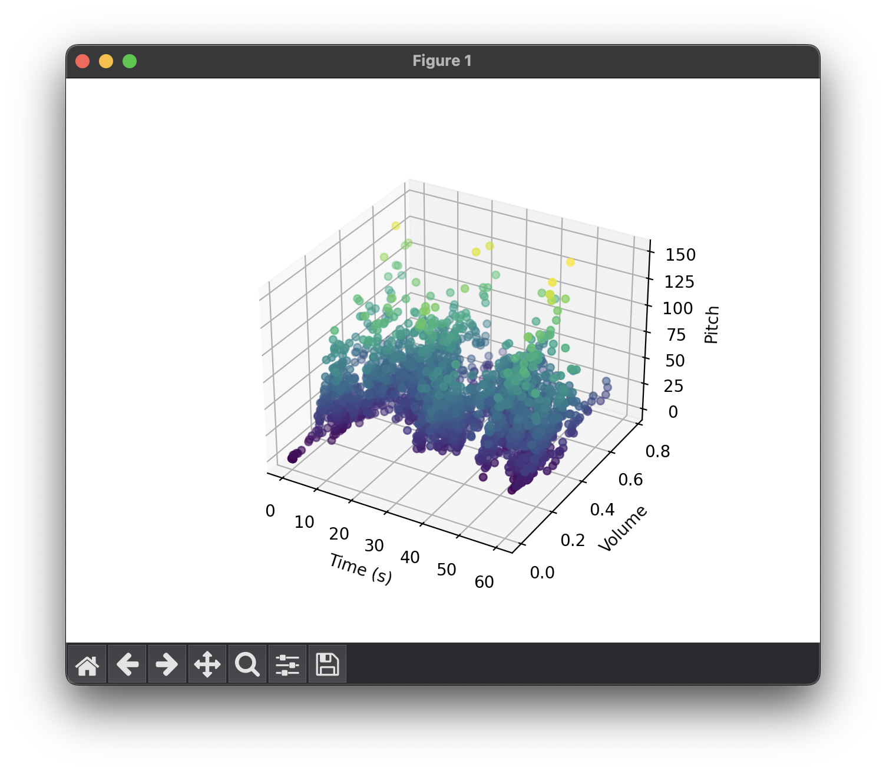
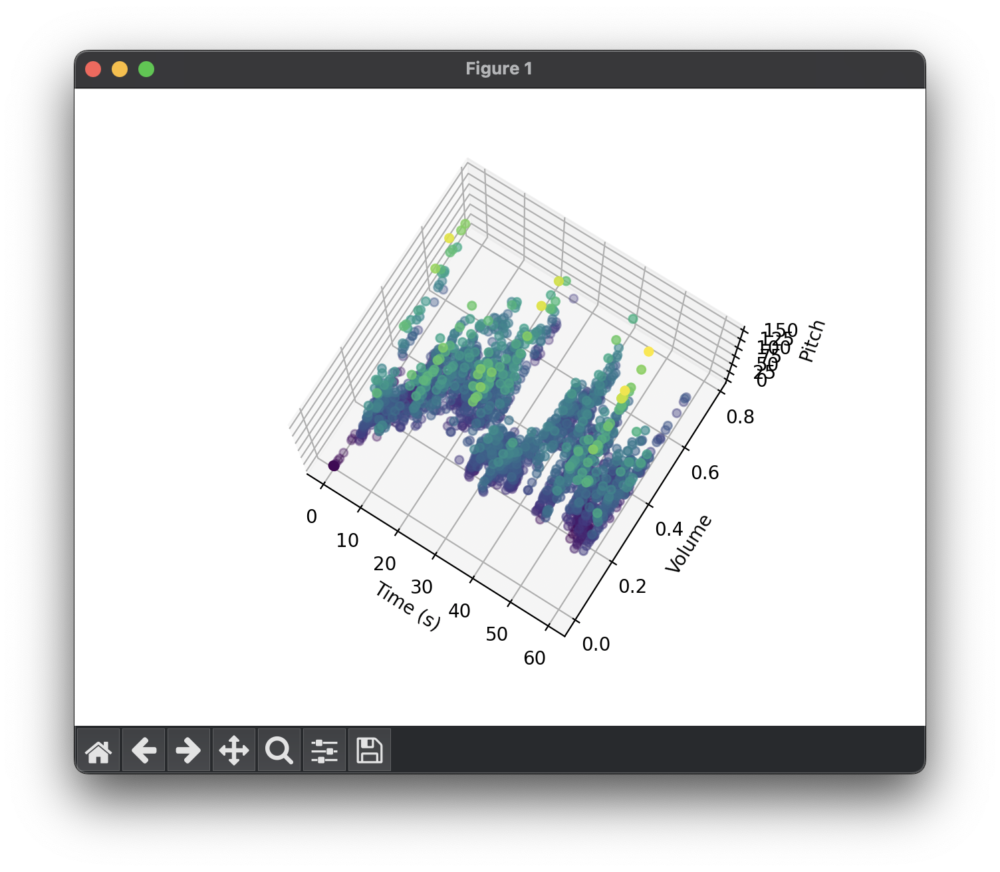
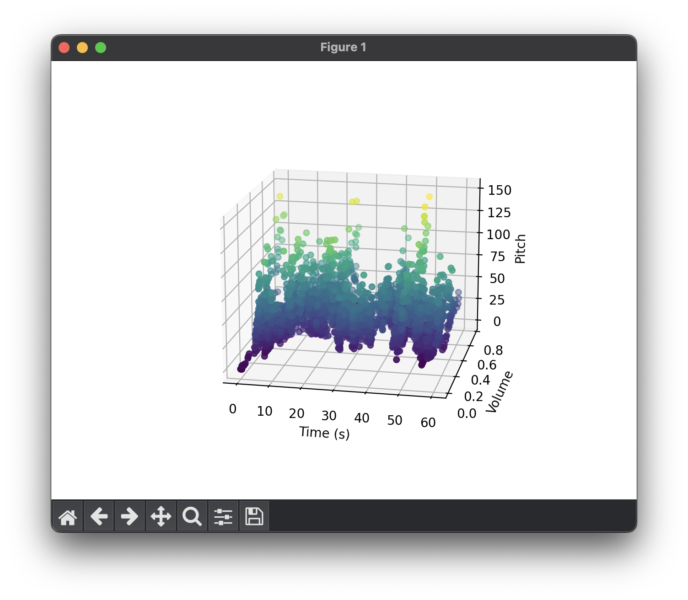
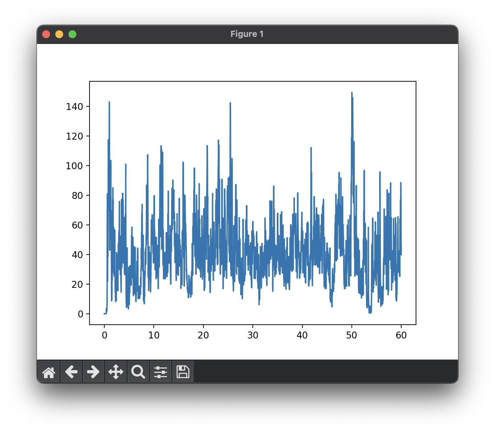
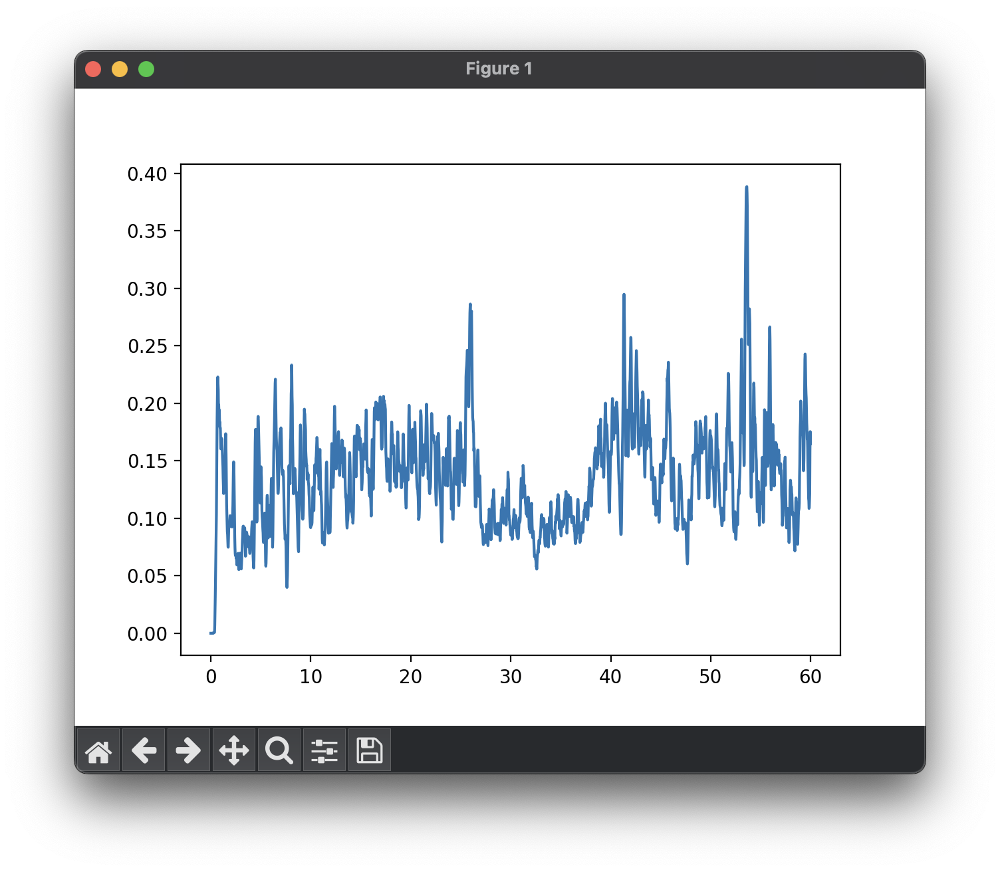

# AudioVis

Visualise audio with graphs.

## Usage

There are two graph types available: `3d` and `2d`. 

### Time pitch volume 3D

This plots the time, pitch and volume of the audio file. 






```python
import AudioVis

AudioVis.time_pitch_volume_3d("audio.wav")
```

### Time pitch 2D

This plots the time and pitch of the audio file.



```python
import AudioVis

AudioVis.time_pitch_2d("audio.wav")
```

### Time volume 2D

This plots the time and volume of the audio file.



```python
import AudioVis

AudioVis.time_volume_2d("audio.wav")
```

## Licence

This project is licenced under the GNU General Public Licence Version 3.0. See the [LICENCE](LICENCE) file for details.